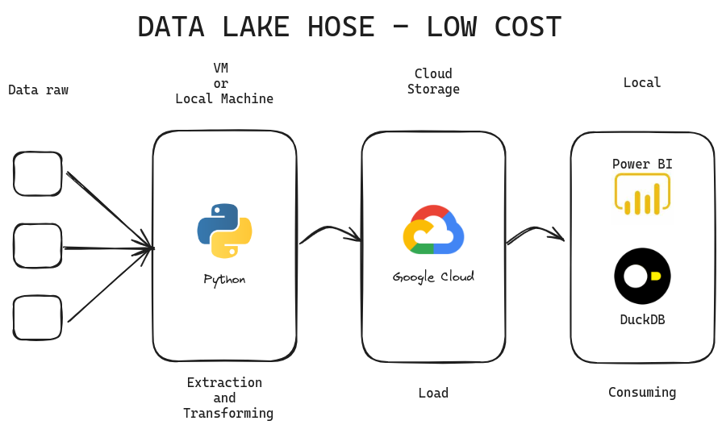

# Data Lake House

## Escopo do Teste MVP de Data Pipeline Utilizando Python, GCP e DuckDB

##### Objetivo:

Desenvolver e validar um MVP de data pipeline para coletar, transformar e armazenar dados de API's. Os dados serão
processados utilizando Python, armazenados no Cloud Storage da Google e visualizados através do Power BI.

### Etapas do Projeto:

#### Coleta de Dados:

* Acesso e autenticação na API do (Ocultado) utilizando Python.
* Seleção dos endpoints específicos da API para coleta de dados.
* Definição da frequência de coleta de dados.

##### Processamento e Transformação de Dados com Python e DuckDB:

* Desenvolvimento de scripts Python para a extração de dados da API.
* Utilização de bibliotecas Python (Pandas) para transformação e limpeza dos dados.
* Uso do DuckDB para consultas SQL interativas e análise exploratória.
* Testes para validar a integridade e a qualidade dos dados processados.

##### Armazenamento de Dados no Google Cloud:

* Configuração da pipeline de dados para carregar os dados transformados em Buckets no Cloud Storage do Google (GCP).
* Monitoramento do processo de carga de dados para identificação de potenciais falhas.

##### Integração com Power BI:

* Conexão do GCP ao Power BI.
* Desenvolvimento de dashboards e relatórios no Power BI para análise dos dados.

### Arquitetura proposta:

### Custos Estimados:

#### Custos de Desenvolvimento e Operação:

* Recursos computacionais para desenvolvimento e execução dos scripts Python.

#### Custos de Armazenamento no Google Cloud:

* Custos de armazenado no Cloud Storage do Google Cloud.

#### Custos de Ferramentas e Licenças:

* Licença do Power BI.
* Possíveis custos de ferramentas adicionais para orquestração e monitoramento da pipeline (se necessário).

#### Considerações Adicionais:

* Segurança e Privacidade dos Dados: Implementação de medidas para proteger os dados durante a coleta, processamento e armazenamento.
* Documentação: Manutenção de documentação detalhada sobre os scripts Python, consultas DuckDB e processos de pipeline.
* Testes e Validação: Realização de testes rigorosos para garantir a acurácia e a eficácia da pipeline.
